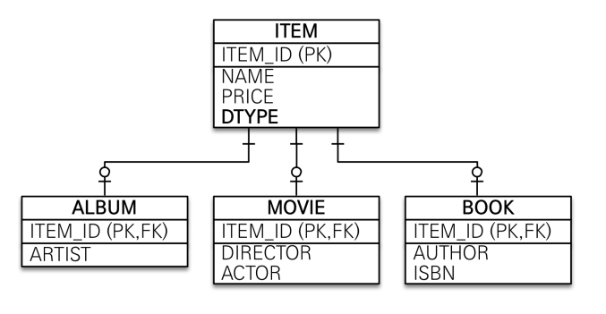
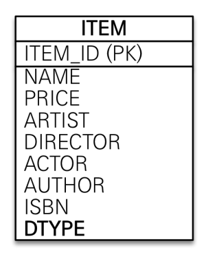
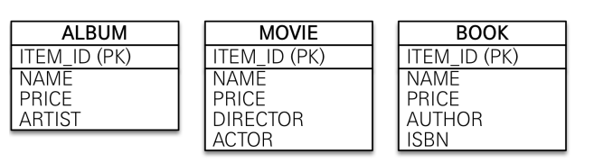
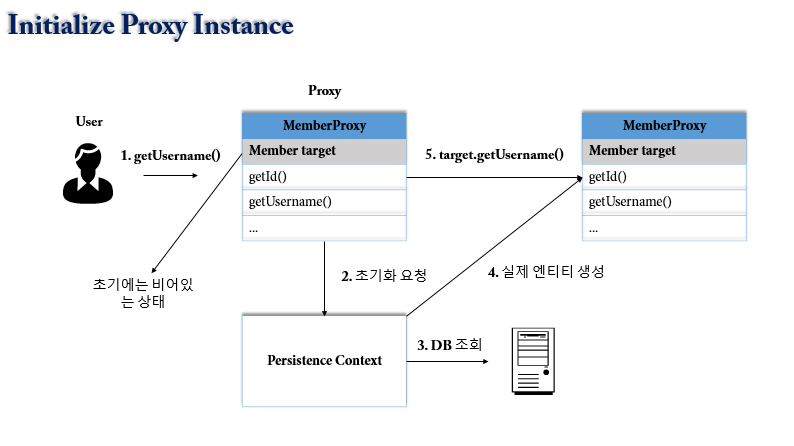

# JPA Issues

### [#issue1] JPA Persistence.xml

- __JPA 를 사용하기 위한 설정파일__
- __Location__
  - src/main/resources/META-INF
  - 해당 classpath 경로에 있으면 별도의 설정 없이 JPA 인식
- __persistence version__
  - Ex. 2.2 버전을 사용한다고 명시
- __persistence-unit__
  - DB 를 생성한다고 보면 된다.
    - 연결할 DB 하나당 영속성 유닛 하나 등록
  - name 속성에는 DB 이름 작성
- __class__
  - `<class>entity</class>`
  - 엔티티 인식이 안되면 다음과 같은 에러가 발생한다.
    - `java.lang.IllegalArgumentException: Unknown entity`
  - 빌드 환경에 따라서 클래스 인식이 자동으로 안되는 경우가 있을때 아래 구문을 사용하면 된다.
  - ```xml
    <persistence-unit name="purejpa">
          <class>com.jtcwp.purejpa.domain.member.Member</class>
          <properties>
            // 생략
          </properties>
    </persistence-unit>
    ```

#### [#issue1-1] javax.persistence vs hibernate.xxx

- javax.persistence
  - JPA 가 ORM 기술에 대한 API 표준 명세
  - 따라서, JPA 를 구현한 구현체가 바뀌어도 상관 없음
- hibernate.xxx
  - JPA 의 구현체 중 hibernate 를 사용 

#### [#issue1-2] EntityManagerFactory 생성 과정
 
- __JPA 구동 과정__
  - persistence.xml 설정 정보를 조회하여 Persistence 를 생성하고 EntityManagerFactory 를 생성하여 EntityManager 들을 생성한다.
- __EntityManagerFactory 생성 과정__
  - PersistenceXmlParser 클래스의 locatePersistenceUnits 메서드를 보면 META-INF 아래에 있는 persistence.xml 설정 정보를 조회해서 접근가능한 모든 영속성 유닛들을 가져온다.
  - EntityManagerFactoryBuilderImpl 에서 Properties properties = persistenceUnit.getProperties(); 다음과 같은 코드로 xml 에 설정 되어 있는 속성들(DB 접속 정보, hibernate.format_sql 등)을 가져와서 HashMap 에 담는다.
  - 내부에서 몇가지 단계를 거쳐서 MergedSettings 객체에 HashMap 에 담아뒀던 정보들과 다른 추가적인 설정 값들(java.vender.url, java.version, PID 등)을 담고, 기타 등등 과정을 거쳐서 객체를 생성한다.
  - 만약, 데이터베이스 연결에 실패하게되면 아래와 같은 에러가 발생한다.
    - `Cannot get a connection as the driver manager is not properly initialized`

### [#issue3] EntityManagerFactory, EntityManager

- EntityManagerFactory : 하나만 생성하여 애플리케이션 전체에서 공유
- EntityManager : 쓰레드간 공유하면 안된다. 사용하고 버려야 함
  - [EntityManager 를 쓰레드간 공유하면 안되는 이유](https://techvu.dev/117)

#### [#issue3-1] EntityTransaction

- EntityTransaction : 영속성 컨텍스트에 있는 엔티티에 대한 트랜잭션 처리를 할 수있는 인터페이스
- 순수 JPA 사용 시 트랜잭션 처리 방법
  - ```java
    // 순수 JPA 사용 시 정석 코드
    EntityManagerFactory emf = Persistence.createEntityManagerFactory(persistenceUnitName);
    EntityManager em = emf.createEntityManager();
    EntityTransaction tx = em.getTransaction();
    tx.begin();
    try {
        Member member = new Member();
        member.setId(1L);
        member.setUserName("Jungho");
        em.persist(member);
        tx.commit();
    } catch (Exception e) {
        tx.rollback();
    } finally {
        em.close();
    }
    emf.close();
    ```
    
### [#issue4] 영속성 컨텍스트(Persistence Context)

- __영속성 컨텍스트(Persistence Context)__
  - 엔티티를 영구 저장하는 환경
  - 엔티티를 `식별자(javax.persistence.Id; @Id)`로 구분
    - 따라서, 엔티티에는 식별자 값이 필수임.
    - @Entity 어노테이션 적용 후 @Id 없으면 IDE 에서 미리 잡아준다.
    - persist() 로 영속 상태로 만들 때, id 에 대한 값을 지정하지 않으면 다음과 같은 에러 발생
      - `javax.persistence.PersistenceException: org.hibernate.id.IdentifierGenerationException: ids for this class must be manually assigned before calling save()`
  - 영속 상태의 엔티티는 `1차 캐시`에 저장된다.
    - 즉, 영속성 컨텍스트가 내부에 Map 으로된 캐시를 가지고 있고, `KEY : @Id, VALUE : entity` 를 가지고 있다.
- [JPA 는 1차 캐시를 통해서 Repeatable Read 를 애플리케이션 레벨에서 지원한다.](https://techvu.dev/116)
  
#### [#issue4-1] 플러시(flush)

- DB 에 값이 저장되기 위해선 영속성 컨텍스트에 있는 값이 트랜잭션에 의해서 `커밋(commit)` 되어야 함.
- persist(entity) 를 한다고 SQL 문이 실행되는 것이 아니다. 이때는 영속성 컨텍스트에 엔티티가 저장되는 순간이고, 트랜잭션이 커밋되는 시점에 JPA 가 SQL 문을 만들어서 실행.
- `플러시(flush)` : 트랜잭션에 의해서 커밋되는 순간 영속성 컨텍스트에 있는 값이 DB 에 반영되는 것을 말한다.
  - em.flush() : 직접 호출
  - 트랜잭션 커밋 시 플러시 자동 호출
  - JPQL 쿼리 실행 시 플러시 자동 호출
- 플러시는 영속성 컨텍스트의 변경 내용을 DB 에 동기화 하는 작업이다.
- __동작 과정__
  - 변경 감지(Dirty Checking)
  - 수정된 Entity 를 쓰기 지연 SQL 저장소에 등록
  - 쓰기 지연 SQL 저장소의 Query 를 DB 에 전송(Create, Update, Delete Query)
  - 트랜잭션이 시작되고 해당 트랜잭션이 commit 되는 시점 직전에만 동기화 (변경 내용을 날림) 해주면 되기 때문에, 그 사이에서 플러시 매커니즘의 동작이 가능한 것이다.
    - JPA는 기본적으로 데이터를 맞추거나 동시성에 관련된 것들은 데이터베이스 트랜잭션에 위임한다.

- __플러시 사용__

```java
tx.begin();
try {
    Team team = new Team();
    team.setName("ABC");
    em.persist(team);

    Member member = new Member();
    member.setUsername("BAEK");
    member.setTeam(team);
    em.persist(member);

    em.flush(); // 영속성 컨텍스트의 변경 내용을 DB 에 동기화
    em.clear(); // 영속성 컨텍스트를 비워줌으로써 준영속 상태가 된다.

    // 데이터베이스에서 조회
    Member findMember = em.find(Member.class, member.getId());
    List<Member> members = findMember.getTeam().getMembers();

    for (Member m : members) {
        System.out.println(m.getUsername());
    }
    tx.commit();
} catch (Exception e) {
    tx.rollback();
} finally {
    em.close();
}
emf.close();
```

- __플러시 미사용__

```java
tx.begin();
try {
    Team team = new Team();
    team.setName("NKLCWDT");
    em.persist(team);

    Member member = new Member();
    member.setUsername("JungHo");
    member.setTeam(team);
    em.persist(member);

    // 1차 캐시에서 조회
    Member findMember = em.find(Member.class, member.getId());
    Team findTeam = findMember.getTeam();
    System.out.println("Team : " + findTeam.getName());
    tx.commit();
} catch (Exception e) {
    tx.rollback();
} finally {
    em.close();
}
emf.close();
```

### [#issue5] 객체와 테이블 매핑

- __@Table__
  - Index 생성
    - `@Table(name = "orders", indexes = @Index(name = "idx_member_id", columnList = "member_id"))`
    - ```java
      @NoArgsConstructor
      @Getter
      @Setter
      @Entity
      @Table(name = "orders", indexes = @Index(name = "idx_member_id", columnList = "member_id"))
      public class Order {

          @Column(name = "order_id", length = 20)
          @GeneratedValue(strategy = GenerationType.IDENTITY)
          @Id
          private Long id;

          @Column(name = "member_id", length = 20)
          private Long memberId;

          @Column(name = "order_date", length = 6)
          private LocalDateTime orderDate;

          @Column(name = "status", length = 100)
          @Enumerated(EnumType.STRING)
          private OrderStatus status;
      }
      ```
- setter 는 가급적 필요한 컬럼에 대해서만 열어두는게 좋다. 무분별하게 setter 를 사용하면 어디서든 엔티티의 값을 변경할 수 있기 때문에 유지보수성이 떨어진다.
- [테이블과 컬럼에 대한 명세를 엔티티에 자세하게 적는것이 좋은지?](https://techvu.dev/120)

### [#issue6] 필드와 컬럼 매핑

- __@Column__
  - `@Column(name = "name")` : 테이블 컬럼의 이름을 필드에 매핑
  - `@Column(name = "name", nullable = false)` : DDL 생성 시 NOT NULL 제약조건 추가
  - `@Column(name = "name", columnDefinition = "varchar(100) default 'empty'")` : DDL 에 그대로 내용 추가
- __@Enumerated__
  - `@Enumerated(EnumType.ORDINAL)` : 기본값, enum 순서를 데이터베이스에 저장 EX. 1, 2 ...
  - `@Enumerated(EnumType.STRING)` : enum 이름을 데이터베이스에 저장. 이 방식이 더 좋다. 나중에 enum 이 추가되었을때 순서에 의한 문제가 없다.
- __날짜 관련__
  - 구 트렌드 : @Temporal 사용
    - `@Temporal(TemporalType.TIMESTAMP)`
      - TemporalType : DATE or TIME or TIMESTAMP
  - 최신 트렌드 : LocalDate or LocalDateTime 사용
    - 애노테이션이 없어도 하이버네이트가 타입을 보고 알아서 판단해준다.
    - private LocalDateTime createdAt;

### [#issue7] 기본키 매핑

- __직접 할당__
  - `@Id` 만 사용
    - ```java
      @Id
      private Long id;
      ```
- __자동 생성__
  - `@GeneratedValue`
  - IDENTITY : 데이터베이스에 위임 : MySQL, PostgreSQL, SQL Server, DB2 등
      - ```java
        @Id
        @GeneratedValue(strategy = GenerationType.IDENTITY)
        private Long id;
        ```
      - __해당 전략을 사용하면 em.persist 시점에 INSERT 쿼리를 날린후, DB 에 등록된 ID(PK) 값을 내부적으로 다시 조회해서 JPA 가 엔티티에 값을 바인딩 해준다.__
      - __일반적으로 JPA 는 트랜잭션 커밋 시점에 INSERT SQL 을 날리는 반면, IDENTITY 전략은 em.persist 시점에 날리는 것을 알 수 있다.__
      - ```java
        Member member = new Member();
        member.setUsername("BAEK");
        em.persist(member); // INSERT SQL 실행 -> 실행과 동시에 내부적으로 DB 에 등록된 ID(PK) 값을 조회해서 member 엔티티에 바인딩
        System.out.println(member.getId());
        tx.commit();
        ```
  - SEQUENCE : 데이터베이스 시퀀스 오브젝트 사용 : Oracle, PostgreSQL, DB2, H2 등
    - @SequenceGenerator 필요
    - ```java
       @Entity
       @SequenceGenerator(
          name = "MEMBER_SEQ_GENERATOR",
          sequenceName = "MEMBER_SEQ",
          initialValue = 1, allocationSize = 1)
       public class Member {
          @Id
          @GeneratedValue(strategy = GenerationType.SEQUENCE, generator = "MEMBER_SEQ_GENERATOR")
          private Long id;
       }
       ```
    - @SequenceGenerator 속성
      - allocationSize : 시퀀스 호출 할 때 마다 증가하는 수(데이터베이스 시퀀스 값이 하나씩 증가하도록 설정되어있다면 이 값을 반드시 1로 설정해야 한다. 기본값은 `50`)
      - name : 식별자 생성기 이름
      - sequenceName : 데이터베이스에 등록되어 있는 시퀀스 이름
      - initialValue : DDL 생성시에만 사용 된다. 시퀀스 DDL 생성시, 처음 시작하는 수를 의미
      - catalog, schema : 데이터베이스 catalog, schema 이름
  - TABLE : 키 생성용 테이블 사용(시퀀스를 흉내내는 전략), 모든 DB 에서 사용
    - @TableGenerator 필요
    - 장점은 모든 데이터베이스에 적용가능하다는 것이고, 단점은 성능이다.
  - AUTO : 기본 값, 방언에 따라 자동 지정

#### [#issue7-1] 권장하는 기본키 전략

- 기본키 제약 조건 : Not null, Unique, 먼 미래에서도 제약 조건이 변하면 안된다.
- 권장 : `Long Type + 대체 키(인조키) + 키 생성 전략 사용`
- [기본키 매핑 전략에 따른 INSERT QUERY 실행 시점](https://techvu.dev/118)

#### [#issue7-2] allocationSize 를 통한 성능 최적화

- allocationSize 가 기본이 50으로 잡혀있는 이유는 성능을 최적화 하기 위해서이다.
- 데이터베이스에서는 시퀀스 값을 미리 50까지 증가시켜놓은다음, 메모리에서 1~50 까지 생성되어있는 값을 가져다 쓰는것이다.
- 이렇게 하면 50번 마다 `sequence call(call next value for sequenceName)`이 일어나기 때문에 성능적 이점이 있다. 
- 여러개의 WAS, Web Server 가 있어도 동시성 이슈가 없이 사용 가능하다.
- [AllocationSize 를 통한 성능 최적화](https://techvu.dev/119)

### [#issue8] JPA 와 데이터베이스 연결

- __Persistence.xml 사용하는 경우__
  - `H2`
    - ```xml
      <property name="javax.persistence.jdbc.driver" value="org.h2.Driver"/>
      <property name="javax.persistence.jdbc.user" value="sa"/>
      <property name="javax.persistence.jdbc.password" value=""/>
      <property name="javax.persistence.jdbc.url" value="jdbc:h2:tcp://localhost/~/purejpa"/>
      <property name="hibernate.dialect" value="org.hibernate.dialect.H2Dialect"/>
      ```
  - `MySQL`
    - ```xml
      <property name="javax.persistence.jdbc.driver" value="com.mysql.cj.jdbc.Driver"/>
      <property name="javax.persistence.jdbc.user" value="root"/>
      <property name="javax.persistence.jdbc.password" value="root"/>
      <property name="javax.persistence.jdbc.url" value="jdbc:mysql://localhost:3306/jpastudy"/>
      <property name="hibernate.dialect" value="org.hibernate.dialect.MySQL57Dialect"/>
      ```
    - driver 를 `com.mysql.jdbc.Driver` 로 설정할 경우 아래와 같은 에러를 볼 수 있다.
    - Loading class `com.mysql.jdbc.Driver'. This is deprecated. The new driver class is `com.mysql.cj.jdbc.Driver'. The driver is automatically registered via the SPI and manual loading of the driver class is generally unnecessary.

### [#issue9] 연관관계 매핑

- 테이블은 항상 양방향 연관관계를 가진다. 하지만 객체는 사실상 양방향 연관관계를 가지지 못하고, 비지니스 규칙으로 잘 묶어서 서로 다른 단방향 연관관계를 양방향 처럼 보이게 하는 것이다.

#### [#issue9-1] 연관관계 주인

- 연관관계의 주인이란 테이블의 외래키를 수정하고 다룰 수 있는 엔티티를 의미한다.
- 외래키를 갖고 있는 엔티티가 연관관계의 주인이 된다.
- Ex. Team : Member : 1 : N 관계에서는 Member 테이블에 FK 가 존재하므로, Membmer 엔티티가 연관관계의 주인이 된다.
- 연관관계의 주인은 항상 `@ManyToOne` 쪽이 된다.
  - 객체와 매핑할 테이블의 FK 를 지정해줘야 한다 : `@JoinColumn(name = "team_id")`
  - ```java
    @NoArgsConstructor
    @Getter @Setter
    @Entity
    @Table(name = "member")
    public class Member {

      @Column(name = "member_id", length = 20)
      @GeneratedValue(strategy = GenerationType.IDENTITY)
      @Id
      private Long id;

      @JoinColumn(name = "team_id")
      @ManyToOne
      private Team team;
    
    // 생략
    }
    ```
  - 다대일 관계에서 `多` 에 속하는 쪽이 FK 를 갖기 때문에 연관관계의 주인이 된다.  
    - @ManyToOne : Many = Member, One = Team
- 연관관계 주인을 설정할 때, 비즈니스 로직을 기준으로 연관관계의 주인을 선택하면 안되며, `외래 키의 위치`를 기준으로 정해야한다.

#### [#issue9-2] 양방향 연관관계와 mappedBy

양방향 연관관계를 설정하기 위해서 `mappedBy` 에 대한 이해가 완벽하게 되어야 한다.

- __객체와 테이블의 연관관계__
  - 객체 : `단방향 연관관계 2개`
  - 테이블 : `양방향 연관관계 1개` (FK 에 의해서 JOIN 으로 양방향으로 참조 가능)
  - 객체는 양방향 연관관계를 표현하기 위해서 단방향 연관관계를 2개 만들어서 사용한다.
    - 따라서, 각 엔티티에 연관관계를 맺는 엔티티에 대한 참조 변수를 만들어서 사용한다.

- __양방향 연관관계 매핑 규칙__
  - @ManyToOne 을 사용하는 객체를 연관관계의 주인으로 지정 : `FK 가 존재하는 테이블에 매핑되는 엔티티가 연관관계의 주인`
    - 연관관계의 주인만 외래키를 관리(등록, 수정)
    - 주인이 아닌 쪽은 읽기만 가능
  - 주인이 아닌 쪽은 `mappedBy` 속성으로 주인 지정
    - ```java
      // team 은 Member 에서 @ManyToOne 으로 지정된 객체 이름
      @OneToMany(mappedBy = "team")
      private List<Member> members = new ArrayList<>();
      ```
- __mappedBy 가 지정된 필드는 Create, Update, Delete 쿼리가 나가지 않는다.__
  - __연관관계의 주인이 아닌 곳에서만 관계 설정__
    - ```java
      Member member = new Member();
      member.setUsername("Test");
      em.persist(member);

      // Team 에만 member 를 설정해도 데이터베이스에서 Member 테이블에 TEAM FK 가 설정되지 않는다.
      // mappedBy 는 읽기 전용이라. 등록, 수정, 삭제에서 아무런 영향을 끼치지 못한다.
      Team team = new Team();
      team.setName("ABC");
      team.getMembers().add(member);
      em.persist(team);

      em.flush(); // 영속성 컨텍스트의 변경 내용을 DB 에 동기화
      em.clear(); // 영속성 컨텍스트를 비워줌으로써 준영속 상태가 된다.
      ```
  - __연관관계의 주인인 곳에서만 관계 설정__
    - ```java
      Team team = new Team();
      team.setName("ABC");
      em.persist(team);

      // MEMBER 테이블에 TEAM FK 가 설정된다.
      Member member = new Member();
      member.setUsername("Test");
      member.setTeam(team);
      em.persist(member);

      em.flush(); // 영속성 컨텍스트의 변경 내용을 DB 에 동기화
      em.clear(); // 영속성 컨텍스트를 비워줌으로써 준영속 상태가 된다.
      ```
  - __연관관계의 주인과 주인이 아닌 곳 둘 다 관계 설정__
    - ```java
      Team team = new Team();
      team.setName("ABC");
      em.persist(team);

      Member member = new Member();
      member.setUsername("Test");
      member.setTeam(team);
      // mappedBy 가 지정된 것은 CUD Query 에 영향을 미치지 않는다.
      team.getMembers().add(member); 
      em.persist(member);

      em.flush(); // 영속성 컨텍스트의 변경 내용을 DB 에 동기화
      em.clear(); // 영속성 컨텍스트를 비워줌으로써 준영속 상태가 된다.
      ```
  - __mappedBy 로 지정된 필드에 값이 설정되더라도 CUD Query 에 영향이 없으니까, 연관관계 주인에만 값을 설정해주면 되는것 아닌가?__
    - `둘다 값을 설정 해주는 것이 좋다.`
    - ```java
      Team team = new Team();
      team.setName("ABC");
      em.persist(team);

      Member member = new Member();
      member.setUsername("Test");
      member.setTeam(team);
      // mappedBy 가 지정된 것은 CUD Query 에 영향을 미치지 않는다.
      team.getMembers().add(member);
      em.persist(member);

      em.flush(); // 영속성 컨텍스트의 변경 내용을 DB 에 동기화
      em.clear(); // 영속성 컨텍스트를 비워줌으로써 준영속 상태가 된다.

      // 데이터베이스에서 조회
      // Team 조회 쿼리 생성
      Team findTeam = em.find(Team.class, team.getId());
      // 지연 로딩에 의해서 실제 Member 객체를 꺼내 사용하는 시점에 조회 쿼리 생성
      List<Member> members = findTeam.getMembers(); 
      for (Member m : members) {
          System.out.println(m.getUsername());
      }
      ```
    - ```java
      Team team = new Team();
      team.setName("ABC");
      em.persist(team);

      Member member = new Member();
      member.setUsername("Test");
      member.setTeam(team);
      // team.getMembers().add(member);
      em.persist(member);

      // 1차 캐시에서 조회
      Team findTeam = em.find(Team.class, team.getId());
      // 1차 캐시에 Team 안에 members 가 없기 때문에 아무것도 찍히지 않는다.
      List<Member> members = findTeam.getMembers(); 
      for (Member m : members) {
          System.out.println(m.getUsername());
      }
      ```
    - 따라서, 1차 캐시에서 정상적으로 연관관계를 설정한 객체를 꺼내서 사용하기 위해서는 연관관계 주인과, 주인이 아닌곳 둘 다 객체를 넣어야 한다.

#### [#issue9-3] 연관관계 편의 메서드

양방향 연관관계를 설정하기 위해 아래와 같이 코딩하게 되면, 깜빡하고 설정을 안할 수 도 있다.

```java
Member member = new Member();
member.setUsername("Test");
member.setTeam(team);
// 이렇게 매번 설정해주는 것은 번거롭고 깜빡하기 쉽다.
team.getMembers().add(member);
em.persist(member);
```

따라서, `연관관계 편의 메서드` 를 작성하면 편리하게 양방향 연관관계 설정을 할 수 있다.

- __방식 1__

```java
@Entity
public class Member {
  // 생략
  
  @ManyToOne
  @JoinColumn(name = "TEAM_ID")
  private Team team;
  
  // 연관관계 편의 메서드
  public void changeTeam(Team team) {
    this.team = team;
    team.getMembers().add(this);
  }
}
```

- __방식 2__

```java
@Entity
public class Team {
  // 생략
  
  // 연관관계 편의 메서드
  public void addMember(Member member) {
      member.setTeam(this);
      members.add(member);
  }
}
```

두 가지 방식 중 하나를 선택해서 사용하면 된다.

> 접두사 set 은 추천하지 않는다. getter, setter 에 사용되는 규칙이기 때문에 change 등 다른 단어로 대체하여 사용하는 것이 좋다.

#### [#issue9-4] 양방향 연관관계 매핑 시 무한루프 주의

- __toString() : StackOverflowError__
  - Ex. Member 와 Team 에서 서로 toString() 을 구현하는 경우
  - Member 의 toString 에서 team 을 호출하기 때문에, team.toString() 을 호출하게 된다.
  - Team 에서도 members 를 호출하기 때문에 member 들의 toString() 을 계속 호출하게 된다.
- __JSON 생성 라이브러리__
  - Ex. Response 로 Member Entity 를 사용하는 경우
  - Member Entity 를 JSON 으로 바꾸려는데, 안에 team 이 존재해서 Team 을 또 JSON 으로 바꾸려고하고, team 안에는 members 가 존재해서 members 를 JSON 으로 바꾸려고 시도하는 동작이 계속 발생
  - 따라서, `컨트롤러에서는 엔티티를 반환하지 말아야 한다 !!` 
    - 첫 번째 이유 : 무한루프발생
    - 두 번째 이유 : 엔티티는 언제든 변경될 수 있기 때문에, 엔티티가 변경되면 응답, 요청등에 대한 API 스펙이 바뀌게 되는 셈이다.
    - 이러한 이유로 `DTO` 를 만들어서 사용

#### [#issue9-5] 양방향 연관관계 실무 팁

- 단방향 연관관계로 설계를 끝내 놓는다.
- 양방향 연관관계 매핑(mappedBy)은 테이블에 영향을 주지 않기 때문에 필요할 때 추가하면 된다.
  - 양방향 매핑은 객체 그래프 탐색 기능이 추가된 것 뿐이다.

#### [#issue9-6] [다양한 연관관계 매핑과 설정에 따른 트레이드 오프](https://techvu.dev/122)

### [#issue10] 상속관계 매핑

- __조인 전략__
  - 
  - `@Inheritance(strategy = InheritanceType.JOINED)` 명시 해줘야 함, 기본 전략은 단일 테이블 전략
  - ```java
    @NoArgsConstructor
    @Getter
    @Setter
    @DiscriminatorColumn
    @Inheritance(strategy = InheritanceType.JOINED)
    @Entity
    @Table(name = "item")
    public class Item {

        @Column(name = "item_id", length = 20)
        @GeneratedValue(strategy = GenerationType.IDENTITY)
        @Id
        private Long id;

        @Column(length = 255)
        private String name;

        @Column(length = 11)
        private int price;

        @Column(name = "stock_quantity", length = 11)
        private int stockQuantity;
    }
    
    @DiscriminatorValue("A")
    @Entity
    public class Album extends Item {

        private String aritist;
    }
    ```
  - 장점
    - 테이블 정규화
    - 외래키 참조 무결성 제약조건 활용 가능
    - 저장공간 효율화
  - 단점
    - 조회 시 조인을 많이 사용, 성능저하(하지만, 조인 잘 사용하면 괜찮음)
    - 조회 쿼리가 복잡
    - 데이터 저장시 INSERT SQL 2번 호출
- __단일 테이블 전략__
  - 
  - `@Inheritance(strategy = InheritanceType.SINGLE_TABLE)`
  - `@DiscriminatorColumn` 명시 필수
  - 장점
    - 조인이 필요 없으므로 일반적으로 조회 성능이 빠름
    - 조회 쿼리가 단순
  - 단점
    - 자식 엔티티가 매핑한 컬럼은 모두 null 허용
    - 단일 테이블에 모든 것을 저장하므로 테이블이 커질 수 있다. 상황에 따라서 조회 성능이 오히려 느려질 수 있다.
- __구현 클래스마다 테이블 전략__
  - 
  - `@Inheritance(strategy = InheritanceType.TABLE_PER_CLASS)`
  - 이 전략은 추천 X
  - 단점
    - 여러 자식 테이블을 함께 조회할 때 성능이 느림(UNION SQL 필요)
    - 자식 테이블을 통합해서 쿼리하기 어려움

__실무에서 조인 테이블 전략과, 단일 테이블 전략 중 어떤 것을 사용할지 DBA 와 상의하여 결정__

#### [#issue10-1] @DiscriminatorColumn

- @DiscriminatorColumn 를 엔티티에 명시하면 테이블에 `DTYPE` 컬럼이 생성됨.
- @DiscriminatorColumn 에 값을 지정할 수 있는데, 아무 값도 지정되어있지 않으면 엔티티 명으로 DTYPE 에 들어감.
  - @DiscriminatorColumn("ABC") 이런식으로 지정 가능.

#### [#issue10-2] @MappedSuperclass

- 테이블과 관계 없고, 단순히 엔티티가 공통으로 사용하는 매핑 정보를 모으는 역할
- @MappedSuperclass 를 추상 클래스에 명시하고 서브 클래스에서 상속 받아서 사용할 수 있음.
  - 즉, 엔티티의 공통 속성들을 BaseEntity 라는 추상 클래스에 모아두고 BaseEntity 는 @MappedSuperclass 적용
- 조회, 검색 불가(em.find(BaseEntity) 불가)
- 직접 생성해서 사용할 일이 없기 때문에 `추상 클래스`를 권장

> @Entity 클래스는 엔티티나 @MappedSuperclass 로 지정한 클래스만 상속 가능

```java
@Getter @Setter
@MappedSuperclass
public abstract class BaseEntity {

    private String createdBy;
    private LocalDateTime createdDate;
    private String lastModifiedBy;
    private LocalDateTime lastModifiedDate;
}
```

### [#issue11] em.find vs em.getReference

- `em.find`
  - ```java
    // em.find() 시점에 조회 쿼리가 나간다.
    // findMember : Member@9361
    Member findMember = em.find(Member.class, member.getId());
    System.out.println("username : " + findMember.getUsername());
    System.out.println("id : " + findMember.getId());
    ```
  - 조회쿼리
    - ```sql
      select
        member0_.member_id as member_i1_2_0_,
        member0_.createdBy as createdb2_2_0_,
        member0_.createdDate as createdd3_2_0_,
        member0_.lastModifiedBy as lastmodi4_2_0_,
        member0_.lastModifiedDate as lastmodi5_2_0_,
        member0_.city as city6_2_0_,
        member0_.street as street7_2_0_,
        member0_.team_id as team_id10_2_0_,
        member0_.name as name8_2_0_,
        member0_.zipcode as zipcode9_2_0_,
        team1_.team_id as team_id1_5_1_,
        team1_.createdBy as createdb2_5_1_,
        team1_.createdDate as createdd3_5_1_,
        team1_.lastModifiedBy as lastmodi4_5_1_,
        team1_.lastModifiedDate as lastmodi5_5_1_,
        team1_.name as name6_5_1_ 
      from
          member member0_ 
      left outer join
          team team1_ 
              on member0_.team_id=team1_.team_id 
      where
          member0_.member_id=?
      ```
- `em.getReference()`
  - ```java
    // em.getReference 시점에는 쿼리가 안나간다.
    // findMember: Member$HibernateProxy$U7SsWYXV@9342
    Member findMember = em.getReference(Member.class, member.getId());
    // ID 는 위에서 이미 파라미터로 넘겨서 담아줬기 때문에 조회할때 쿼리가 나가지 않는다.
    System.out.println("id : " + findMember.getId());
    // ID 를 제외한 다른 속성을 조회할때 쿼리가 나간다.
    System.out.println("username : " + findMember.getUsername());
    ```
   - em.getReference() : 데이터베이스 조회를 미루는 프록시 엔티티 조회

### [#issue12] 프록시 객체 초기화



```java
Member findMember = em.getReference(Member.class, member.getId());
findMember.getUsername();
```

- 프록시 객체의 target 에 값이 없을때, 영속성 컨텍스트를 통해서 초기화를 요청한다.
- 영속성 컨테스트는 DB 에서 값을 조회해와서 실제 Entity 를 생성하고, Proxy 객체의 target 변수에 실제 Entity 를 연결한다.

### [#issue13] 프록시 특징

- 프록시 객체는 처음 사용할 때 한 번만 초기화
- 초기화 이후에는 프록시 객체를 통해서 실제 엔티티에 접근 가능
- 프록시 객체는 원본 엔티티를 상속 받음, 따라서 타임 체크시 주의(instanceof 사용, == 비교 X )
- 찾고자 하는 엔티티가 영속성 컨텍스트에 이미 있으면, em.getReference() 를 호출해도 실제 엔티티 반환
  - 이미 1차 캐시에 있는데 굳이 프록시 객체를 만들 이유가 없음.
  - `==` 비교시 true 를 위해 : `JPA 매커니즘 중 하나`
    - 한 트랜잭션안에서 영속성 컨테스트에서 객체를 조회했는데 그 결과가 다르면 안되니까 같은 객체를 조회
    - ```java
      Member member = new Member();
      member.setUsername("Member1");
      em.persist(member);

      em.flush(); // 영속성 컨텍스트의 변경 내용을 DB 에 동기화
      em.clear(); // 영속성 컨텍스트를 비워줌으로써 준영속 상태가 된다.

      Member findMember1 = em.find(Member.class, member.getId());
      Member findMember2 = em.getReference(Member.class, member.getId());
      System.out.println("result : " + findMember1 == findMember2);
      ```
- 준영속 상태일 때, 프록시를 초기화 하면 문제 발생
  - 하이버네이트는 org.hibernate.LazyInitializationException 예외 발생

- 프록시 강제 초기화
  - Ex. member.getName(); 
  - `Hibernate.initialize(findEntity)`

> [Proxy Pattern](https://techvu.dev/112)
>
> [프록시 객체와 영속성 컨텍스트](https://techvu.dev/128)

### [#issue14] LazyLoading vs EagerLoading

- __LazyLoading__
  - 프록시 사용
  - `@ManyToOne(fetch = FetchType.LAZY)`
  - FetchType.LAZY 으로 설정하면 지연 로딩 발생
  - Membmer 조회는 로딩 -> Team 객체의 속성에 직접 접근할 때 조회 쿼리 발생(지연로딩)

```java
생략...

Member m = em.find(Member.class, member.getId());

// Team 은 Proxy : class com.jtcwp.purejpa.domain.Team$HibernateProxy$N1Y9mJLt
System.out.println(m.getTeam().getClass());

// 이 시점에 쿼리가 나감
System.out.println(m.getTeam().getName());

생략...
```

- __EagerLoading__
  - 프록시 사용 안함
  - @ManyToOne(fetch = FetchType.EAGER)
  - 회원과 팀을 한꺼번에 조회

### [#issue14-1] 프록시와 즉시 로딩 주의

- __실무에서는 가급적 지연 로딩(LazyLoading)만 사용__
- 즉시 로딩을 사용하면 예상치 못한 SQL 이 발생할 수 있음
- __즉시 로딩은 JPQL 에서 N + 1 문제를 일으킨다.__
- @ManyToOne, @OneToOne 은 디폴트가 즉시 로딩이므로, 지연 로딩 설정을 따로 해줘야 한다.
- @OneToMany, @ManyToMany 는 디폴트가 지연 로딩
